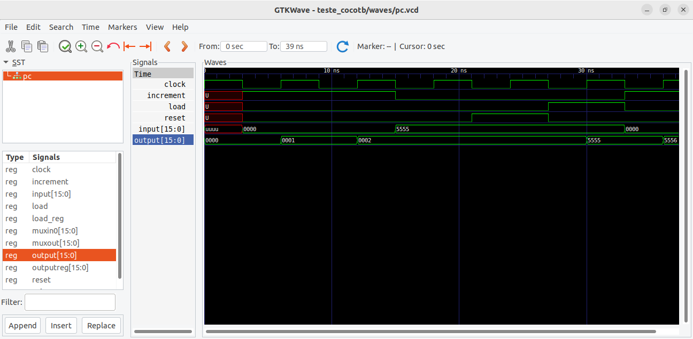

# Av2 - 2° Semestre de 2023


Avaliação 2 - Elementos de Sistemas

| Pontos HW | Pontos SW |
|:---------:|:---------:|
| 40        | 10        |

- Avaliação individual.
- 120 min total.
- Ficar no blackboard durante a prova.
- Fazer commit ao final de cada questão.
- Lembre de dar **push** ao final.


## 1. Lógica combinacional - alarme

| Pontos HW | Pontos SW |
|:---------:|:---------:|
| 10        | 0         |

Um banco quer instalar um sistema de alarme com sensores de movimento.
Os sensores indicam '1' quando há movimento e '0' quando não há.
Há duas zonas de segurança X e Y, sendo que a zona X é composta pelos sensores A, B e C enquanto a zona Y possui os sensores D, E, F e G.
Um alarme (S) dever ser disparado (nível lógico '1') sempre que pelo menos um dos alarmes Sx e Sy de cada zona for disparado.
Para que Sx seja disparado, ao menos dois dos sensores A, B e C devem indicar movimentos simultaneamente.
Para que Sy seja disparado, ao menos dois dos sensores D, E, F e G devem indicar movimentos simultaneamente.

Escreva o código me VHDL para o alarme S.


### Implementação

Implemente a saída `S` no arquivo `src/alarme.vhd`.


**Lembre de testar com `pytest -k alarme`**

#### Rubrica para avaliação:

| Pontos HW | Descritivo                                |
|-----------|-------------------------------------------|
| 3         | Implementação de Sx |
| 3         | Implementação de Sy |
| 4         | Implementação de S  |


## 2. Lógica combinacional - VHDL

| Pontos HW | Pontos SW |
|:---------:|:---------:|
| 10        | 0         |

Considere o código vhdl a seguir:

```

library IEEE; 

use IEEE.STD_LOGIC_1164.ALL;

entity blocoX is

	port ( 

			a:   in  STD_LOGIC_VECTOR(15 downto 0);

			q:  out STD_LOGIC_VECTOR(15 downto 0));

end entity;

architecture rtl of blocoX is

            SIGNAL y: STD_LOGIC_VECTOR(7 downto 0);

begin

            y <= a(15 downto 8) xor a(7 downto 0);

            q <= "00000000" & y;
            
end;
```

### Questões:

1. Explique o que o circuito faz no arquivo `src\blocoX.txt`.
2. Desenhe o circuito lógico correspondente.


#### Rubrica para avaliação:

| Pontos HW | Descritivo                                 |
|-----------|--------------------------------------------|
| 5         | Para cada item |


## 3. Somador

| Pontos HW | Pontos SW |
|:---------:|:---------:|
| 10        | 0         |

Queremos agora implementar o circuito digital da figura a seguir:


Esse circuito é um somador Carry-Lookahed de 4 bits que evita a propagação do vaium que ocorre no somador visto em aula.

### Implementação/questão:

1. Implemente o somador de 4 bits no arquivo `src\add4.vhd`

**Para simplificar a implementação, considere c0 = '0'. Não é necessário implementar a saída c4**

**Considere que a saída q no arquivo vhd representa um vetor com os bits S3 S2 S1 S0.**

2. Qual a vantagem em se evitar a propagação do carry entre os Full-Adders? Responda no arquivo `src\carry.txt`.

**Lembre de testar com `pytest -k add4`**

#### Rubrica para avaliação:

| Pontos HW | Descritivo                                 |
|-----------|--------------------------------------------|
| 7         | Implementação do somador |
| 3         | Vantagem do circuito     |

## 4. Lógica sequencial

| Pontos HW | Pontos SW |
|:---------:|:---------:|
| 10        | 0         |

Queremos agora implementar o circuito digital da figura a seguir:


Utilize o Flip-Flop D desenvolvido em aula para implementar o circuito.

### Implementação/questão:

1. Implemente o circuito no arquivo `src\circuito.vhd`
2. Qual a função do circuito? Responda no arquivo `src\circuito.txt`.

**Lembre de testar com `pytest -k circuito`**

#### Rubrica para avaliação:

| Pontos HW | Descritivo                                 |
|-----------|--------------------------------------------|
| 7         | Implementação do circuito |
| 3         | Função do circuito        |


## 5. Identificação de erro


| Pontos HW    | Pontos SW      |
| :--------:   | :--:           |
|    0         |  10            |

A figura a seguir apresenta as curvas obtidas no GTKWave como resultado da simulação do módulo `pc.vhd`.
Entretanto, esse módulo apresenta um erro. Identifique, a partir das curvas fornecidas a condição em que está ocorrendo o erro.

{width=300}


### Implementação

Identifique o intervalo em que o erro ocorre e descreva qual seria o resultado esperado no arquivo `src/erro_pc.txt`.

#### Rubrica para avaliação:

| Pontos SW | Descritivo                                           |
|-----------|------------------------------------------------------|
| 10        | Intervalo identificado e erro descrito corretamente. |
| 5         | Apenas o intervalo foi identificado corretamente.    |

