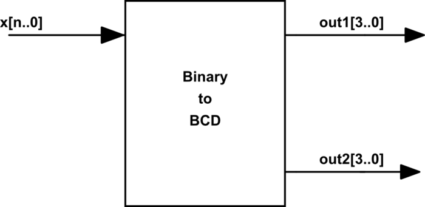
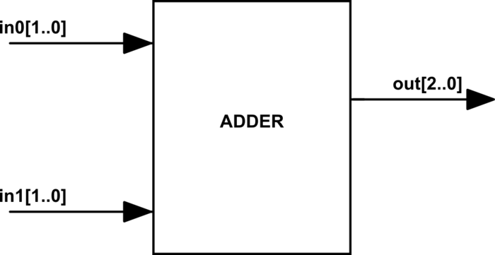

# EleSis
---

## Sumário
- [Álgebra Booleana](#álgebra-booleana)
- [Tabela Verdade](#tabela-verdade)
- [Equações booleanas e suas operações](#equações-booleanas-e-suas-operações)
    - [Not](#not)
    - [And](#and)
    - [Or](#or)
    - [Nand](#nand)
- [Teoria Componentes](#teoria-componentes)
    - [Componentes Digitais](#componentes-digitais)
    - [Portas Lógicas](#portas-lógicas)
    - [Multiplexador(MUX)](#multiplexador-mux)
    - [Demultiplexador(DEMUX)](#demultiplexador-demux)
- [Enconders](#enconders)
    - [Binary-coded Decimal (BCD)](#binary-coded-decimal-bcd)
    - [Gray Code](#gray-code)
    - [Comparador](#comparador)
    - [Somadores](#somadores)
- [Teoria Aritmética Binária](#teoria-aritmética-binária)
    - [Half-Adder (HAD)](#half-adder-had)
    - [Full-Adder (FAD)](#full-adder-fad)
    - [Somador](#somador)
- [Teoria Lógica Sequencial](#teoria-lógica-sequencial)
    - [Circuitos biestáveis](#circuitos-biestáveis)
    - [Clock](#clock)
    - [Flip-Flop](#flip-flop)
    - [Flip-Flop tipo D](#flip-flop-tipo-d)
- [VHDL](#vhdl)
    - [Conceitos Básicos](#conceitos-básicos)
    - [Entity](#entity)
    - [Arquitetura (architecture)](#arquitetura-architecture)
    - [VHDL: Combinacional](#vhdl-combinacional)
    - [VHDL: Sequencial](#vhdl-sequencial)

#
---
## Algebra Booleana
---

### Introdução
Na álgebra booleana, as variáveis podem assumir apenas dois valores: 0 ou 1.


#
### Tabela Verdade
- A tabela verdade é uma tabela que mostra todas as combinações possíveis de valores de entrada e a saída correspondente para uma equação booleana.
- A tabela verdade vai ter $\mathbf{2^n}$
 linhas, onde `n` é o número de variáveis de entrada.

#
### Equações booleanas e Suas Operações

As equações booleanas são expressões matemáticas que descrevem o comportamento de um circuito digital. Elas podem possuir uma ou mais entradas e apenas uma saída.
#
- #### NOT

 A operação de `not` é uma inversão da entrada: se a `entrada (A) `do operador for `1` sua `saída (X)` será `0` e vice versa.

| Entrada A | Saída(X) |
|:---------:|:---------:|
|     0     |     1     |
|     1     |     0     |

**Equação:** `X =` $\bar{A}$
#
- #### AND

 A operação de `and` pode ser entendida como uma multiplicação: A `saída (X)` só é verdadeira se as entradas `A` e `B` forem verdadeiras: `1` $\cdot\$  `1` = `1`

| Entrada A | Entrada B | Saída(X) |
|:---------:|:---------:|:---------:|
|     0     |     0     |     0     |
|     0     |     1     |     0     |
|     1     |     0     |     0     |
|     1     |     1     |     1     |

**Equação:** `X =`  `A` $\cdot\$ `B`
#
- #### OR

 A operação de `or` pode ser entendida como uma adição: A `saída (X)` só é verdadeira se pelo menos uma das entradas `A` ou `B` for verdadeira: `1 + 0 = 1`

| Entrada A | Entrada B | Saída(X) |
|:---------:|:---------:|:---------:|
|     0     |     0     |     0     |
|     0     |     1     |     1     |
|     1     |     0     |     1     |
|     1     |     1     |     1     |

**Equação:** `X = A + B`
#
- #### NAND

 A operação de `nand` é a inversão da operação `and`: A `saída (X)` só é verdadeira verdadeira quando as entradas `A` e `B` são falsas: `0`  $\cdot\$ `0` = `1`  

| Entrada A | Entrada B | Saída(X) |
|:---------:|:---------:|:---------:|
|     0     |     0     |     1     |
|     0     |     1     |     1     |
|     1     |     0     |     1     |
|     1     |     1     |     0     |

**Equação:** `X =` $\overline{A \cdot B}$
#

---
## Teoria Componentes Componentes Digitais
---
#
Os componentes digitais são os blocos de construção básicos de circuitos digitais. Eles são usados para realizar operações lógicas e aritméticas.
#

### Portas Lógicas
```VHDL
S <= A and B; 
S <= A nand B; S <= not (A and B)
S <= A or B;
S <= A nor B;  S <= not (A or B);
S <= A xor B;
S <= (not A);
```
#
### Multiplexador(MUX) ####

O **MUX** é um componente que possui `n` entradas e uma saída `q`, um sinal chamado de seletor `sel` seleciona qual entrada irá ser copiada para a saída.
As entradas `n` e a saída `q` podem ser binárias ou vetor de tamanho `m`.

```VHDL
entity mux is port(
    in0 : in  std_logic;
    in1 : in  std_logic;
    sel : in  std_logic;
    o : out std_logic);
end entity;
```
#
 **Tabela Verdade do MUX de 2 entradas**
 
| In 0 | In 1 | sel | out |
|:---------:|:---------:|:-------:|:-----:|
|     1     |     X     |    0    |   1   |
|     X     |     0     |    1    |   0   |
|     0     |     X     |    0    |   0   |
|     X     |     1     |    1    |   1   |

!!! note "Observação"
    A tabela verdade do mux de 2 entradas possuir $\mathbf{2^3}$ linhas (o seletor conta como entrada), totalizando 8 linhas. Porém para simplificar, utilizamos o `X` que significa tanto faz (`0` ou `1`), logo cada linha que possui `1` seria expandida para duas linhas.

!!! note "Tamanho do seletor"


    | Quantidade de entradas (n)  | Tamanho do seletor |
    |:---------------------------:|:------------------:|
    |              2              |          1         |
    |              3              |          2         |
    |              4              |          2         |
    |              5              |          3         |
    |              8              |          3         |


    ``Tamanho do seletor`` = $ \log_2(\text{size}(n))$

#
### Demultiplexador(DEMUX)

O **Demux** possui uma entrada `in` e `n` saídas `q`, o demux conecta a entrada a alguma das saídas, sendo controladas pelo sinal de seletor `sel`.

```VHDL
entity demux is
port(
        in0   : in  std_logic;
        sel   : in  std_logic;
        out0  : out std_logic;
        out1  : out std_logic
);
end entity;
```
#

**Tabela Verdade do DEMUX de 2 saídas**

| In 0| Sel | Out 0 | Out 1 |
|:---------:|:-------:|:-------:|:-------:|
|  1  |  0  |   1   |   0   |
|  1  |  1  |   0   |   1   |
|  0  |  1  |   0   |   0   |
|  0  |  0  |   0   |   0   |

#
### Enconders

Enconders são componentes que codificam uma entrada em uma saída de outro formato.

- #### Binary-coded Decimal (BCD)
É uma forma de codificação de números inteiros em binário na qual utiliza-se para cada dígito de um número inteiro, 4 bits em binário.

| Decimal Number| BCD 8421 Code |
|:-------------:|:-------------:|
|       0       |     0000 0000     |
|       1       |     0000 0001     |
|       2       |     0000 0010     |
|       3       |     0000 0011     |
|       4       |     0000 0100     |
|       5       |     0000 0101     |
|       6       |     0000 0110     |
|       7       |     0000 0111     |
|       8       |     0000 1000     |
|       9       |     0000 1001     |
|       10 (1+0)     |     0001 0000     |
|       11 (1+1)     |     0001 0001     |
|       12 (1+2)     |     0001 0010     |
|       continua     |     em blocos de 4 bits     |

!!! note "Diagrama"

    

#
```VHDL
entity binaryToBCD is
port(
        x    : in  std_logic(4 downto 0);
        out0 : out std_logic_vector(3 downto 0); -- Unidade
        out1 : out std_logic_vector(3 downto 0)  -- Dezena
);
end entity;
```
**Observação:** O maior valor que um bloco de 4 bits do BCD assume é o 1001 que é referente ao número inteiro 9.
#
- #### Gray Code

O código gray é uma forma de codificar números binários, nessa codificação apenas um bit muda por vez.

| Código decimal | Código Binário | Código Gray |
|:--------------:|:--------------:|:-----------:|
|        0       |      0000      |    0000     |
|        1       |      0001      |    0001     |
|        2       |      0010      |    0011     |
|        3       |      0011      |    0010     |
|        4       |      0100      |    0110     |
|        5       |      0101      |    0111     |
|        6       |      0110      |    0101     |
|        7       |      0111      |    0100     |
|        8       |      1000      |    1100     |
|        9       |      1001      |    1101     |
|       10       |      1010      |    1111     |
|       11       |      1011      |    1110     |
|       12       |      1100      |    1010     |
|       13       |      1101      |    1011     |
|       14       |      1110      |    1001     |
|       15       |      1111      |    1000     |

#
### Comparador

Comparadores são componentes que podem possuir diversos atributos, tais como comparar:

- se duas entradas são iguais
- se a entrada A é maior que entrada B
- se entrada A é igual a zero
- ...

A seguir um exemplo de um comparador que possui apenas uma entrada `x[1..0]` e compara se essa entrada é **igual a zero (eq)** `(x == 0)`, ou se é **maior que zero (gt)** `(x > 0)`.

| X (Inteiro) | X (Binário) | EQ | GT |
|:-----------:|:-----------:|:--:|:--:|
|      0      |     00      |  1 |  0 |
|      1      |     01      |  0 |  1 |
|     -1      |     11      |  0 |  0 |
|      2      |     10      |  0 |  1 |

!!! note "Diagama"

    
#
```VHDL
entity COMPARADOR is
port(
        x  : in  std_logic_vector(1 downto 0);
        eq : out std_logic;
        gt : out std_logic
);
end entity;
```
#
### Somadores

Os somadores são componentes que realizam a soma de dois números binários.

Um somador de dois vetores de dois bits cada possui o seguinte comportamento:

| in0 | in1 | out |
|:---:|:---:|:---:|
|  00 |  00 |  00 |
|  00 |  01 |  01 |
|  01 |  01 |  10 |
|  10 |  01 |  011 |
|  10 |  11 |  101 |
|  11 |  11 |  110 |

!!! note "Diagrama"

    

```VHDL
    entity ADDER is
    port(
            in0   : in  std_logic(1 downto 0);
            in1   : in  std_logic(1 downto 0);
            o     : out std_logic_vector(2 downto 0)
    );
    end entity;
```
#
---
## Teoria Aritmética Binária-HW
---
#
### Half-Adder (HAD)

**Half-Adder (HAD**) é um circuito digital capaz de somar dois bits (`a` e `b`), tem como resultado o valor da `soma` e do `carry`, como ilustrado a seguir:
#
**Tabela Verdade do Half-Adder**

| a | b | carry(out) | soma(out) |
|:-:|:-:|:----------:|:---------:|
| 0 | 0 |     0      |     0     |
| 0 | 1 |     0      |     1     |
| 1 | 0 |     0      |     1     |
| 1 | 1 |     1      |     0     |

!!! note "Diagrama"

    

E é implementado em hardware da seguinte maneira:
#

#
### Full-Adder (FAD)

**Full-Adder (FAD)** é um componente digital capaz de somar três bits (`a`, `b` e `c`), tem como resultado o valor da `soma` e do `carry`.
#
**Tabela Verdade do Full-Adder**

| a | b | c | carry(out) | soma(out) |
|:-:|:-:|:-:|:----------:|:---------:|
| 0 | 0 | 0 |     0      |     0     |
| 0 | 0 | 1 |     0      |     1     |
| 0 | 1 | 0 |     0      |     1     |
| 0 | 1 | 1 |     1      |     0     |
| 1 | 0 | 0 |     0      |     1     |
| 1 | 0 | 1 |     1      |     0     |
| 1 | 1 | 0 |     1      |     0     |
| 1 | 1 | 1 |     1      |     1     |

!!! note "Diagrama"

    
#
E é implementado em hardware da seguinte maneira:

    

#
### Somador

Utilizando o **FAD** somos capazes de realizar um somador de dois vetores binários. Para isso, teremos que utilizar um full-adder para cada bit desse nosso vetor.

Por exemplo: se formos criar um Somador capaz de somar dois vetores de 4bits, necessitamos utilizar 4 FAD para isso com a ligação descrita a seguir:


Nesse diagrama, estamos realizando a soma ente os vetores `A(3 downto 0)` e `B(3 downto 0) `que resulta em um outro vetor `S(3 downto 0)` e um carry `C4`.

#
---
## Teoria Lógica Sequencial
---
Na lógica sequencial, o estado anterior das entradas influencia na saída, ou seja, essa lógica possui uma memória.


Sistemas sequências são em sua grande maioria combinados com sistema síncrono, onde todos o circuito digital opera em um determinado ritmo, esse sinal é conhecido como clock do sistema.
#
### Circuitos biestáveis

Os circuitos biestáveis permancem em um dos dois estados binário (`0` ou `1`) enquanto estiver energizado. Eles são usados para armazenar e recuperar os estados dos bits dos computadores.

- #### latch SR
O latch SR é um circuito biestável composto de duas portas NOR que armazenam um valor simples.


Neste circuito normalmente as entradas `S` e `R`, conhecidas como `Set` e `Reset`, ficam em nível baixo. Enquanto estiverem assim o valor das saídas `Q` e $\overline{Q}$, que é sempre o inverso do `Q`, se mantem inalterados. Se o nível do `S` subir (`1`) a saída `Q` fica em nível alto, ou podemos dizer `1`, já se o nível do `R`, `Q` fica em nível lógico baixo, ou seja `0`. 

**Tabela Verdade do Latch SR:**

| S | R | Q | $\overline{Q}$ |
|:-:|:-:|:-:|:-------------:|
| 0 | 0 | Armazenado | Armazenado |
| 1 | 0 | 0 | 1 |
| 0 | 1 | 0 | 1 |
| 1 | 1 | metaestável | metaestável |

**metaestável**: Indica que a saída pode ser 0 ou 1, e que não podemos prever qual será.
#
- #### Latch Tipo D

O latch tipo D é um circuito biestável, nesse caso o circuito mantem o valor da entrada de Dados D enquanto a entrada de Enable `E` estiver em nível alto, se o sinal `E` for para nível baixo o circuito não muda de estado.


**Tabela Verdade do Latch D:**

| E | D | Q | $\overline{Q}$ |
|:-:|:-:|:-:|:-------------:|
| 0 | 0 | Armazenado | Armazenado |
| 0 | 1 | Armazenado | Armazenado |
| 1 | 0 | Copiada Entrada `D:` `0 `| Copia Entrada `D` negada: `1` |
| 0 | 1 | Copiada Entrada `D:` `1 `| Copia Entrada `D` negada: `0` |
#
### Clock

O clock é um sinal elétrico periódico utilizado para sincronizar sistemas digitais, utilizado em todo circuito síncrono, serve como o 'baterista' da banda, dando o ritmo de execução para a eletrônica. A cada novo clock (instante que ocorre uma mudança no sinal `0 -> 1`), o sistema começa uma nova operação. O sinal do clock é geralmente periódico e de modulação 50% (50% em alto e 50% em baixo):


- **Frequência:**
    F = $\frac{1}{L}$

- **Clock de 3Ghz**
    São 3 bilhões `3.000.000.000` de bordas `(0 -> 1)` em um segundo!! Imagine que a cada borda, uma operação é realizada no computador, são 3 bilhões de operações em um único segundo....

- **Overclock:**

    Nessa técnica, aumentasse o clock para uma frequência na qual o sistema não foi projetado para operar, consequências disso são:

    - Possíveis erros de processamento (dado que parte do circuito pode ser mais lento que o $\frac{1}{L}$)
    - Superaquecimento do chip, já que a tecnologia atual utilizada para fabricação de componentes eletrônicos (MOSFET) 'gasta' energia a cada clock. Com um aumento no clock, mais energia é gasta por segundo

- **Borda:**

    Nem todo sistema digital trabalha com borda de subida (rising_edge) (0 -> 1), outras opções são:

    - borda de descida `(falling_edge): 1 -> 0`.
    double data rate (DDR): Uma nova mudança a cada borda, subida e descida. (Dai que vem o nome da memória DDR4 do seu computador!)
#
### Flip-Flop

Flip-Flop (FF) é um circuito similar ao LATCH porém síncrono, ou seja, a mudança na saída (Q) só ocorre na borda do clock.

- #### Flip-Flop tipo D:
O Flip-Flop tipo D possui as seguintes portas:

- `D:` entrada do de Dado
- `Q:` saída do dado copiado
- $\overline{Q}:$ saída do dado copiado negado
- `CLK:` entrada do clock 


Toda vez que o ocorre uma borda de subina no clock, o sinal que está na entrada D é copiado para a saída Q, conforme diagrama a seguir:


**Tabela Verdade do Flip-Flop D:**

| D (in) | CLK (in) | Q (out) |
|:------:|:--------:|:-------:|
|    0   |    0     |    Q*    |
|    1   |    1     |    Q*    |
|    0   |    ^     |    0     |
|    1   |    ^     |    1     |

- **Observação:**
    - `^`: indica que a borda de subida do clock
    - `Q*`: indica que o valor de `Q` é o mesmo que o valor anterior

    ##### Clear e Preset 
FF do tipo D podem possuir mais dois sinais de controle: `clear` e `preset`. O sinal `clear` faz com que a saída `Q` vá para `0` independe da entada `D` e do `clock`. O sinal `preset` faz com que a saída `Q` vá para `1` independente da entrada `D` e do `clock`.

**Tabela Verdade do Flip-Flop D com Clear e Preset:**

| D (in) | Clear | Set | CLK (in) | Q (out) |
|:------:|:-----:|:---:|:--------:|:-------:|
|    X   |   0   |  0  |    X     |    Q*   |
|    X   |   1   |  0  |    X     |    0    |
|    X   |   0   |  1  |    X     |    1    |
|    0   |   0   |  0  |    ^     |    0   |
|    1   |   0   |  0  |    ^     |    1   |

#
---
## VHDL
---
VHDL é uma linguagem de descrição de hardware, utilizada para descrever circuitos digitais.

### Conceitos Básicos

Um código em VHDL possui basicamente três partes:

- **Libraries:** Bibliotecas que contém os componentes que serão utilizados no código.

```VHDL
library ieee;
use ieee.std_logic_1164.all;
use ieee.numeric_std.all;
use work.all;
```
#
- #### Entity:

Podemos pensar na entidade como o trecho de código que define o módulo como uma caixa preta, ela explicita quem são as entradas e quais são as saídas desse módulo. Assim como um CHIP, que possui pinos de entradas e pinos de saída.


Uma entidade pode ter nenhuma ou 'infinitas' portas, para adicionarmos uma porta nova a uma entidade, basta adicionarmos uma nova linha com as três propriedades:

```text
NOME : DIREÇÃO TIPO; 
```

**Exemplo:**

Adicionando uma entrada x

```VHDL
entity TopLevel is
  port(
        x : in std_logic;
        a : in  std_logic;
        b : out std_logic
  );
end entity;
```

**Observação:** O ; não deve aparecer na última porta!

**DIREÇÃO:** 

A direção `in, out` define se a informação irá `entrar` no módulo ou `sair` do módulo.

**TIPO:**

O tipo define se a porta será composta por um único bit `std_logic` ou por um vetor de bits `std_logic_vector(2 downto 0)` (vetor de 3 bits).

!!! note "Mais Exemplos"
    - Módulo com duas entradas binárias: `a, x` e uma saída `b`

    ```VHDL
        entity Comp1 is
        port(
                a   : in  std_logic;
                x   : in  std_logic;
                b   : out std_logic
        );
        end entity;
    ```
    

    - Módulo chamado MUX que possui 4 entradas na forma de um vetor ( `I : in std_logic_vector(3 downto 0` )), um seletor de dois bits na forma de um vetor (S) e uma saída q na forma de um bit.

    ```VHDL
        entity MUX is
        port(
                I : in  std_logic_vector(3 downto 0);
                S : in  std_logic_vector(1 downto 0);
                q : out std_logic
        );
        end entity;
    ```

    

    - Entidade de uma ULA:

    ```VHDL
    entity ALU is
        port (
                x: in STD_LOGIC_VECTOR(15 downto 0); -- entrada X de dados da ALU
                y: in STD_LOGIC_VECTOR(15 downto 0); -- entrada Y de dados da ALU
                zx:    in STD_LOGIC;                     -- zera a entrada x
                nx:    in STD_LOGIC;                     -- inverte a entrada x
                zy:    in STD_LOGIC;                     -- zera a entrada y
                ny:    in STD_LOGIC;                     -- inverte a entrada y
                f:     in STD_LOGIC;                     -- se 0 calcula x & y, senão x + y
                no:    in STD_LOGIC;                     -- inverte o valor da saída
                zr:    out STD_LOGIC;                    -- setado se saída igual a zero
                ng:    out STD_LOGIC;                    -- setado se saída é negativa
                saida: out STD_LOGIC_VECTOR(15 downto 0) -- saída de dados da ALU
        );
    end entity;
    ```

    

#
- #### Arquitetura (architecture)

A arquitetura (`architecture`) define a relação das entradas com as saídas da entidade. Nessa parte é onde será construída a lógica digital desse módulo. Pense que é na arquitetura onde transcrevemos uma equação lógica, ou onde descrevemos uma memória.

```VHDL
architecture rtl of TopLevel is

-- Aqui é declaro os possíveis:
--   a) sinais internos de uma entidade
--   b) outras entidades que essa entidade pode utilizar

begin

    -- Aqui é onde a coisa acontece de verdade
    -- onde é feita a descrição da lógica digital
    a <= not b;

end rtl;
```
#
- #### Operações Básicas:

!!! note "Suponha o uso da entidade a seguir para os exemplos seguintes"
    ``` VHDL
        entity Foo is
        port(
            x   : in  std_logic;
            y   : in  std_logic;
            q   : out std_logic;
            p   : out std_logic
        );
    end entity;
    ```
No VHDL usamos `<=` para representar que alguma coisa (a esquerda da seta) recebe algum outro valor (a direita da seta). Exemplos:

1. `q <= x;`
    - `q `recebe o valor de `x`
    - Na prática estamos conectando um fio de `x` que liga em `q`

2. `q <= '0';`
    - `q` recebe o valor `0`
    - Na prática estamos conectando um fio que sai de `q` e liga no terra
3. `q <= '1';`
    - `q` recebe o valor `1`
    - Na prática estamos conectando um fio que sai de `q` e liga no VCC

**Observação:**
Note que aqui estamos usando aspas simples: `'0'` e `'1'`para indicar um número binário (`std_logic`). Aspas dupla "`0101`" em VHDL significa que estamos trabalhando com um vetor de números binários (`std_logic_vector`).

Podemos utilizar portas lógicas nas operações, alguns operadores implementados pela linguagem, são: `not, and, or, nand, nor, xor, xnor`. O uso dos operadores é feito da seguinte maneira:

1. `q <= not x;`
    - `q` recebe o valor de `x` **negado**
2. `q <= x and y;`
    - `q` recebe o valor de `x` **e** `y`
3. `q <= x xor y;`
    - `q` recebe o valor de `x` **XOR** `y`

**Operações com vetores:**

!!! note "Suponha o uso da entidade a seguir para os exemplos seguintes"
    ``` VHDL
    entity Bar is
    port(
            a   : in  std_logic;
            b   : in  std_logic_vector(3 downto 0);
            q   : out std_logic;
            p   : out std_logic_vector(2 downto 0)
    );
    end entity;
    ```
Exemplo de operações com vetores:

1. `p <= "100"
    - `p` recebe o valor em binário `100`

2. `p not "100"
    - `p` recebe o valor `100` ou seja `011`

3. `p <= b(2 downto 0);`
    - `p` recebe os três primeiros bits de `b` 

4. `p(0) <= a;`
    - O primeiro bit (bit 0) de `p` recebe o valor de `a`

5. `q <= not b(1);`
    - A saida binária `q` recebe o valor do segundo bit (bit 1) de `b` negado

**Signal**

Sinais são declarados entre a palavra reservada `architecture` e o `begin` e servem para facilitar/ possibilitar o desenvolvimento de um sistema digital, eles só são visíveis dentro de uma entidade e servem como 'fios' internos de um módulo


**Sinais** são diferente de portas não possuem direção, e são declarados da seguinte maneira:

```VHDL
    signal NAME : TYPE
```

- **TYPE** pode ser `std_logic/ std_logic_vector`, entre outros.

**Exemplo:**

```VHDL
architecture rtl of TopLevel is

-- Declaração de sinais
signal aux1 : std_logic;                
signal aux2 : std_logic_vector(1 downto 0);

-- inicio da implementação
begin

    --------------------
    aux1 <= not a;
    q    <= aux1;
    p(0) <= aux1;

    --------------------
    aux2 <= b(3 downto 2);
    p(2 downto 1) <= aux2;

end rtl;
```
No exemplo anterior, criamos um sinal auxiliar chamado de `aux1` que recebe a entrada a negada, esse sinal é então atribuído a saída `q` e ao `bit 0` da saída `p`. Outro sinal `aux2`, vetor de 2 bits recebe os dois bits mais significativos da entrada `b` e então é atribuído a saída `p`, bits 2 e 1.

#
---
## VHDL Combinacional
---

Em sistemas digitais, lógica combinacional é aquela que não depende do estado anterior (não possui memória), podemos classificar portas lógicas (and, or, nand ...), mux, demux, comparadores, full address e outros componentes como sendo do tipo combinacional.

#
- ### Equações
Podemos escrever equações em VHDL utilizando os seguintes operadores: `not, and, or, nor, xor, xnor.` Como no exemplo a seguir:

X = $(\overline{A} \cdot B) + C$

Transcrevemos para:
```VHDL
X <= ((not A) and B) or C;
```
#
- ### Concatenate
Em VHDL podemos concatenar bit para formar vetores, isso é feito da seguinte forma:

```VHDL
signal bit0, bit1 : std_logic;
signal vec        : std_logic_vector(1 downto 0);

begin

   vec <= bit1 & bit0;

end;
```

No exemplo anterior, temos um vetor de 2 bits (`vec`) que é formado por: `[bit1, bit0]`.

#
- ### With Select

O `with select` em VHDL é utilizado quando desejamos que um sinal (ou saída) receba diferentes valores com base em um sinal de seleção. No exemplo a seguir, o sinal `b` recebe o valor `1000` quando o sinal de seleção `a` for `00, 0100` quando a for `01`, ..., note que no último caso usamos o `others`, ele entrou no lugar do `11`.
```VHDL
signal a : std_logic_vector(1 downto 0); 
signal b : std_logic_Vector(3 downto 0);

begin

with a select 
    b <= "1000" when "00",
         "0100" when "01",
         "0010" when "10",
         "0001" when others;
```

O hardware gerado para o exemplo anterior é:


#

- ### When Else

O construtor` when else `é um pouco mais geral, para cada opção você pode fornecer uma condição diferente. O mesmo exemplo do `with` ficaria escrito da seguinte maneira:

```VHDL
b <= "1000" when a = "00" else 
     "0100" when a = "01" else 
     "0010" when a = "10" else 
     "0001";
```
**Observação:** A última opção não deve possuir nenhuma condição!

Porém com o `when else` temos a flexibilidade de realizar algo como:

```VHDL
b <= "1000" when (a = "00" AND en = '1') else 
     "0100" when (a = "01" AND en = '1') else 
     "0010" when (a = "10" AND en = '1') else 
     "0010" when (a = "00" AND en = '1') else 
     "0000";                                    -- enable desativado
```
---
## VHDL port MAP
---

### Desenvolvimento hierárquico

É uma técnica de organização de projeto onde são desenvolvidos pequenos módulos e esses módulos fazem parte de um sistema maior, que por sua vez, fazem parte de algo muito mais complexo. As vantagens de um desenvolvimento desse tipo são

- Facilidade em realizar testes e validação
    - Cada módulo é testado independentemente

- Trabalho em equipe
    - A partir do momento que as interfaces são bem estabelecidas, cada um do time pode desenvolver um módulo

- Ferramentas gostam / se adaptam bem
    - As ferramentas de desenvolvimento conseguem otimizar o hardware melhor

- Reaproveitamento de módulos
    - Muito mais fácil para reaproveitar outros módulos.
#


---
### Port Map

port map é a maneira em VHDL de reaproveitamos uma entidade definida em outro lugar no nosso arquivo. Pensar em port map como uma função não é de todo errado, mas devesse notar que quando usamos port map estamos criando uma cópia do hardware que é descrito pela entidade usada, isso é diferente de uma função em Python, que reaproveita o mesmo trecho de código para cada chamada de função.

É mais apropriado pensar que a descrição de um hardware é uma receita (que vemos na architecture), o port map seria como o bolo, você pode ter vários bolos com a mesma receita e cada bolo pode ser usado/ir para pessoa diferente (entrada e saídas).

Vamos ver como usar port map com um exemplo a seguir, nesse exemplo possuímos dois arquivos modulo2.vhd e modulo1.vhd, e desejamos utilizar o modulo1 dentro do componente 2 (modulo2):

!!! note "Exemplo"
    ```VHDL

    -- `modulo1.vhd`
    entity modulo1 is
    port (
        a,b : in  std_logic;
        x : out std_logic);
    end entity;

    architecture  rtl OF modulo1 IS
    begin
        x <= a xor b;
    end architecture;
    ```
    ```VHDL

    -- `modulo2.vhd`
    entity modulo2 is
    port (
        i1,i2 : in  std_logic;
        o1    : out std_logic);
    end entity;

    architecture  rtl OF modulo2 IS

    -- Aqui devemos fazer a declaração do componente
    -- que queremos utilizar, a declaração
    -- tem que ser igual a entidade do componente 
    -- original, mas trocando a palavra `entity`
    -- pelo keyword `component`

    component modulo1 is
    port (
        a,b : in  std_logic;
        x : out std_logic);
    end component;

    begin

    -- Agora com o componente 'criado'
    -- podemos utilizar no nosso projeto
    --
    -- podemos dar um 'nome' a intancia do componente
    --  |    
    --  |    | nome do componente a ser usado
    --  v    v
    u1: modulo1 port map(
        a => i1,  -- o sinal a do componente é conectado no sinal i1
        b => i2,  -- o sinal a do componente é conectado no sinal i1
        x => o1   -- o sinal a do componente é conectado no sinal i1
    );

    end architecture;
    ```


#
## Prova semestre 23.2
---

Deve-se baixar o arquivo: **[Prova.zip](./Provas/Av2%20elesis.zip)**

### Enunciado

# Av2 - 2° Semestre de 2023


Avaliação 2 - Elementos de Sistemas

| Pontos HW | Pontos SW |
|:---------:|:---------:|
| 40        | 10        |

- Avaliação individual.
- 120 min total.
- Ficar no blackboard durante a prova.
- Fazer commit ao final de cada questão.
- Lembre de dar **push** ao final.


## 1. Lógica combinacional - alarme

| Pontos HW | Pontos SW |
|:---------:|:---------:|
| 10        | 0         |

Um banco quer instalar um sistema de alarme com sensores de movimento.
Os sensores indicam '1' quando há movimento e '0' quando não há.
Há duas zonas de segurança X e Y, sendo que a zona X é composta pelos sensores A, B e C enquanto a zona Y possui os sensores D, E, F e G.
Um alarme (S) dever ser disparado (nível lógico '1') sempre que pelo menos um dos alarmes Sx e Sy de cada zona for disparado.
Para que Sx seja disparado, ao menos dois dos sensores A, B e C devem indicar movimentos simultaneamente.
Para que Sy seja disparado, ao menos dois dos sensores D, E, F e G devem indicar movimentos simultaneamente.

Escreva o código me VHDL para o alarme S.


### Implementação

Implemente a saída `S` no arquivo `src/alarme.vhd`.


**Lembre de testar com `pytest -k alarme`**

#### Rubrica para avaliação:

| Pontos HW | Descritivo                                |
|-----------|-------------------------------------------|
| 3         | Implementação de Sx |
| 3         | Implementação de Sy |
| 4         | Implementação de S  |


## 2. Lógica combinacional - VHDL

| Pontos HW | Pontos SW |
|:---------:|:---------:|
| 10        | 0         |

Considere o código vhdl a seguir:

```

library IEEE; 

use IEEE.STD_LOGIC_1164.ALL;

entity blocoX is

	port ( 

			a:   in  STD_LOGIC_VECTOR(15 downto 0);

			q:  out STD_LOGIC_VECTOR(15 downto 0));

end entity;

architecture rtl of blocoX is

            SIGNAL y: STD_LOGIC_VECTOR(7 downto 0);

begin

            y <= a(15 downto 8) xor a(7 downto 0);

            q <= "00000000" & y;
            
end;
```

### Questões:

1. Explique o que o circuito faz no arquivo `src\blocoX.txt`.
2. Desenhe o circuito lógico correspondente.


#### Rubrica para avaliação:

| Pontos HW | Descritivo                                 |
|-----------|--------------------------------------------|
| 5         | Para cada item |


## 3. Somador

| Pontos HW | Pontos SW |
|:---------:|:---------:|
| 10        | 0         |

Queremos agora implementar o circuito digital da figura a seguir:


Esse circuito é um somador Carry-Lookahed de 4 bits que evita a propagação do vaium que ocorre no somador visto em aula.

### Implementação/questão:

1. Implemente o somador de 4 bits no arquivo `src\add4.vhd`

**Para simplificar a implementação, considere c0 = '0'. Não é necessário implementar a saída c4**

**Considere que a saída q no arquivo vhd representa um vetor com os bits S3 S2 S1 S0.**

2. Qual a vantagem em se evitar a propagação do carry entre os Full-Adders? Responda no arquivo `src\carry.txt`.

**Lembre de testar com `pytest -k add4`**

#### Rubrica para avaliação:

| Pontos HW | Descritivo                                 |
|-----------|--------------------------------------------|
| 7         | Implementação do somador |
| 3         | Vantagem do circuito     |

## 4. Lógica sequencial

| Pontos HW | Pontos SW |
|:---------:|:---------:|
| 10        | 0         |

Queremos agora implementar o circuito digital da figura a seguir:


Utilize o Flip-Flop D desenvolvido em aula para implementar o circuito.

### Implementação/questão:

1. Implemente o circuito no arquivo `src\circuito.vhd`
2. Qual a função do circuito? Responda no arquivo `src\circuito.txt`.

**Lembre de testar com `pytest -k circuito`**

#### Rubrica para avaliação:

| Pontos HW | Descritivo                                 |
|-----------|--------------------------------------------|
| 7         | Implementação do circuito |
| 3         | Função do circuito        |


## 5. Identificação de erro


| Pontos HW    | Pontos SW      |
| :--------:   | :--:           |
|    0         |  10            |

A figura a seguir apresenta as curvas obtidas no GTKWave como resultado da simulação do módulo `pc.vhd`.
Entretanto, esse módulo apresenta um erro. Identifique, a partir das curvas fornecidas a condição em que está ocorrendo o erro.

{width=300}


### Implementação

Identifique o intervalo em que o erro ocorre e descreva qual seria o resultado esperado no arquivo `src/erro_pc.txt`.

#### Rubrica para avaliação:

| Pontos SW | Descritivo                                           |
|-----------|------------------------------------------------------|
| 10        | Intervalo identificado e erro descrito corretamente. |
| 5         | Apenas o intervalo foi identificado corretamente.    |


